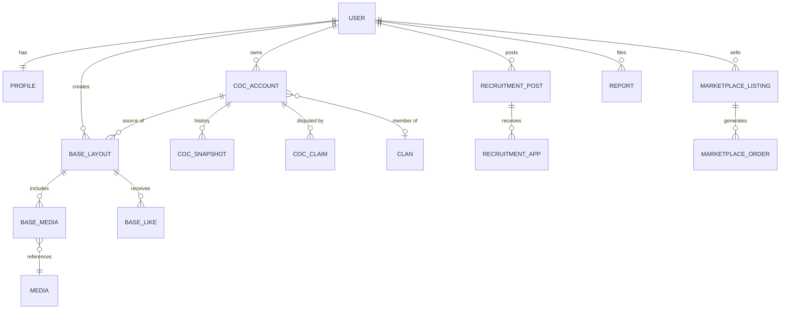

# 03 — Database

## 9. Database schema

PostgreSQL. All tables carry `id`, `created_at`, `updated_at`; soft deletes where content is user-facing. Snapshot/JSON blobs use JSONB.

| Table | Purpose | Key columns | Relationships | Unique / indexes |
| --- | --- | --- | --- | --- |
| users | Website accounts | email, password_hash, email_verified_at, status | has profile, coc_accounts, roles | unique(email); index(status) |
| profiles | Public profile data | user_id, username, bio, avatar_path, featured_account_id, privacy JSONB | belongs to user | unique(user_id), unique(username) |
| roles / permissions / role_user | RBAC (Spatie) | name, guard | many-to-many users | unique(name) |
| coc_accounts | Linked in-game accounts | user_id, tag, ign, state, verified_at, last_synced_at | belongs to user, has snapshots | **unique(tag)**; index(user_id, state) |
| coc_account_claims | Ownership claims/disputes | coc_account_id, claimant_user_id, method, status, evidence JSONB, resolved_by | belongs to coc_account + users | index(coc_account_id, status) |
| coc_account_snapshots | Point-in-time API data | coc_account_id, th_level, trophies, war_stars, league, data JSONB, fetched_at | belongs to coc_account | index(coc_account_id, fetched_at desc) |
| clans | Known clans (from API) | tag, name, level, data JSONB, last_synced_at | has memberships | unique(tag) |
| clan_memberships | Account↔clan link | coc_account_id, clan_id, role, joined_at | belongs to both | index(clan_id); index(coc_account_id) |
| base_layouts | Shared bases | user_id, coc_account_id, title, th_level, category, base_link, visibility, like_count, view_count | belongs to user; has media, tags | index(th_level, category, visibility); index(user_id) |
| base_media | Images/video for a base | base_layout_id, media_id, kind, position | belongs to base + media | index(base_layout_id) |
| base_tags / tags | Tagging | base_layout_id, tag_id | many-to-many | unique(base_layout_id, tag_id) |
| base_comments | Comments | base_layout_id, user_id, body, parent_id, status | belongs to base + user | index(base_layout_id, status) |
| base_likes | Likes | base_layout_id, user_id | belongs to both | **unique(base_layout_id, user_id)** |
| base_bookmarks | Bookmarks | base_layout_id, user_id | belongs to both | unique(base_layout_id, user_id) |
| recruitment_posts | LFC + clan posts | type, user_id, clan_id, th_req, trophies_req, language, location, status, body | belongs to user/clan | index(type, status, language, location) |
| recruitment_applications | Applications/interest | recruitment_post_id, applicant_user_id, coc_account_id, status, message | belongs to post + user | unique(post_id, applicant_user_id) |
| marketplace_listings | Service listings | seller_id, category, title, price, status | belongs to seller | index(category, status) |
| marketplace_orders | Orders | listing_id, buyer_id, seller_id, status, amount, escrow_state | belongs to listing + users | index(buyer_id); index(seller_id, status) |
| marketplace_reviews | Reviews | order_id, rater_id, rating, body | belongs to order + user | unique(order_id, rater_id) |
| conversations | Message threads | subject_type, subject_id (polymorphic) | has messages, participants | index(subject_type, subject_id) |
| messages | Messages | conversation_id, sender_id, body, read_at | belongs to conversation + user | index(conversation_id, created_at) |
| notifications | In-app notifications | user_id, type, data JSONB, read_at | belongs to user | index(user_id, read_at) |
| reports | Abuse reports | reporter_id, reportable_type, reportable_id, reason, evidence JSONB, status, assigned_to | polymorphic | index(reportable_type, reportable_id); index(status) |
| moderation_actions | Mod decisions | moderator_id, target_type, target_id, action, reason | polymorphic | index(target_type, target_id) |
| audit_logs | Sensitive-action trail | actor_id, action, subject_type, subject_id, before JSONB, after JSONB, ip | polymorphic | index(subject_type, subject_id); index(actor_id, created_at) |
| media | Object-storage file records | disk, path, mime, size, checksum, status, uploader_id | referenced by base_media, profiles, coc images | index(status); index(uploader_id) |

**Notes:** `coc_accounts.tag` unique enforces one platform-verified owner per tag (see `04`). Denormalized counters (`like_count`, `view_count`) maintained by events/jobs to avoid `count(*)` on hot paths. Heroes/troops/spells live in one JSONB `data` column, not child tables.

## 10. Main entity relationships

One user owns many CoC accounts; each account carries a history of snapshots and produces bases. Reports, media, and audit logs attach polymorphically.

`COC_ACCOUNT` is the hub — verification, snapshots, clan membership, and bases hang off it, which is why `tag` uniqueness is the platform's integrity anchor.

## Implementation details

- Laravel's existing `users.password` holds the password hash; it is not duplicated as `password_hash`. Spatie retains `guard_name`, `model_has_roles`, `model_has_permissions`, and `role_has_permissions`, with its native composite keys. Existing framework tables are exempt from the generic ID/timestamp convention above.
- `users.status` starts as `active` and is cast to `UserStatus` (`active`, `suspended`, `banned`). Enforcement and transitions belong to moderation/auth workflows; adding the column does not expose a suspension endpoint.
- User status, account state, and report status have database checks matching their backed enums. Account state includes `needs_reverify` for the invalid-tag failure mode in spec 04. Report status follows spec 07's `open`, `assigned`, `resolved`, and `dismissed` lifecycle.
- Domain tables use module-owned migrations, JSONB for structured data, integer counters/amounts, explicit foreign keys, and timestamps. Account tags remain unique even after soft deletion. Profile privacy must be supplied explicitly rather than defaulting to public. Status columns without a lifecycle defined in the domain spec have no inferred default or database enum; the owning feature must define its backed enum before implementing transitions.
- `coc_account_media` links accounts to media with unique `(coc_account_id, media_id)` and `(coc_account_id, position)`. `conversation_participants` links conversations to users with unique `(conversation_id, user_id)`. These complete relationships already described above but missing from the table list. Both include IDs and timestamps.
- Base layouts also store `description` and integer `copy_click_count`, required by spec 01. `tags.name` is unique. Base media associations reserve unique positions and prohibit attaching the same media twice to one base.
- Hard deletion is restricted for content owners, claims, orders, reviews, and audit/moderation actors so history is not silently lost. Soft deletion retains those references. Pure child/association rows cascade with their parent; optional featured-account and parent-comment references become null. Polymorphic targets have compound indexes but cannot have database foreign keys across several tables.
- `notifications` follows this spec's `user_id`/JSONB schema, not Laravel's polymorphic database-notification schema. Its in-app delivery adapter belongs to the Notifications implementation; do not use Laravel's default database notification channel against this table.
- Marketplace `price` and `amount` are integer metadata; `escrow_state` is nullable and has no payment/custody behavior. Marketplace, messaging, and recruitment tables do not enable their deferred features. Currency, rating limits, and unspecified status transitions remain decisions for their owning feature specs.
