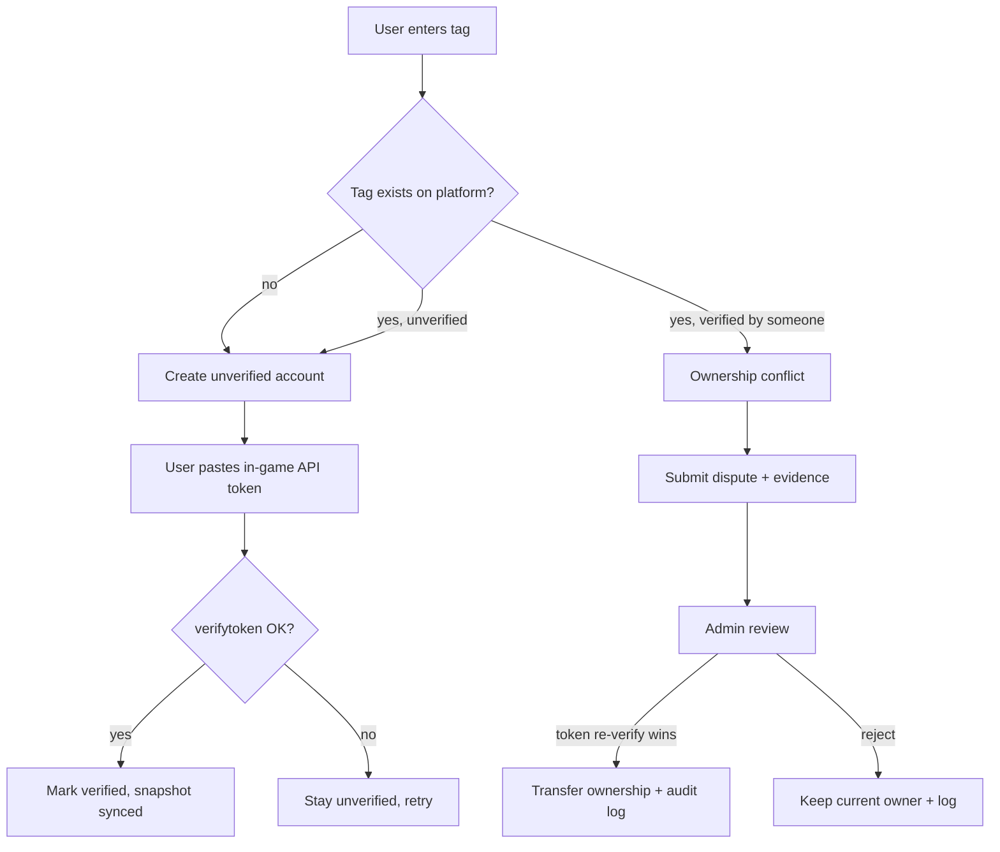

# 04 — CoC Integration & Account Claiming

## 11. CoC API integration architecture

Wrap the official API in an **anti-corruption service layer** so no controller/model calls it directly. The app depends on a `ClashClient` interface; a concrete adapter handles HTTP, auth, retries, and mapping to internal DTOs.

- **Credentials & IP:** Supercell API keys are IP-bound. Provision keys per outbound IP; store as encrypted secrets. On dynamic IPs use a fixed egress (proxy/NAT).
- **Verification:** ownership uses `POST /players/{tag}/verifytoken` with the in-game API token the user pastes — the only reliable proof of ownership. Backbone of §17.
- **Rate limits & caching:** never call the API in a request path. Reads go through cached snapshots; refresh is queued. Cache API responses briefly to collapse duplicate lookups.
- **Background sync:** scheduled jobs refresh verified accounts (staggered every 6–12 h) and clan data; users get a throttled manual "refresh now".
- **Resilience:** retry with backoff on 5xx/429; circuit-breaker during outages; serve last snapshot and mark **stale** with `last_synced_at`.
- **Failure handling:** persist failed attempts; alert on sustained failure; a tag that stops resolving flips to `needs_reverify`, not deletion.
- **Decoupling:** the app reads only from `coc_accounts` + `coc_account_snapshots`, so the API can be swapped, mocked, or rate-shaped without touching feature code.

## 17. CoC account claiming workflow

The integrity core. `coc_accounts.tag` is globally unique — exactly one **verified** owner per tag. Verification uses the in-game API token (`verifytoken`).

- **Happy path:** token verify flips state to `verified`; account is exclusively the user's.
- **Conflict:** a second user cannot auto-attach a verified tag. They may (a) pass `verifytoken` themselves — which wins, since the token means current control — triggering an audited transfer, or (b) open a dispute for admin review where token proof isn't possible.
- **States:** `unverified`, `verified`, `disputed`, `suspended`.
- **Every transfer** writes `audit_logs` (old owner, new owner, method, admin). Losing owner is notified; their bases reassigned or hidden per policy.
- **Edge:** account changes hands in real life → new holder re-verifies with a fresh token and takes over; platform trusts current token control over historical claims.
