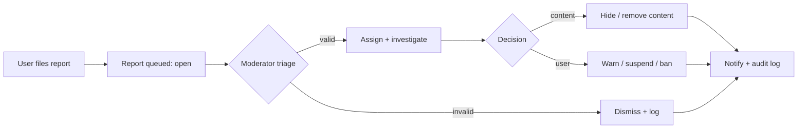

# 07 — Moderation & Reporting

## 15. Moderation & reporting system

Any entity (profile, base, comment, recruitment post, listing, message, user) is reportable through one polymorphic pipeline.

- **Report:** reason (enum), free-text, evidence (links/screenshots), one target via `reportable_type/id`.
- **Queue:** status `open → assigned → resolved/dismissed`; assigned moderator; SLA visible.
- **Actions:** hide/remove content, warn, temp-suspend, ban — recorded in `moderation_actions`; user-facing outcome via notification.
- **Audit:** every decision writes `audit_logs` (actor, before/after, reason).
- **Abuse protections:** spam/bot controls, scam and fake-ownership handling (see `04`), malicious-upload scanning (see `05`), rate-limit abuse throttling, duplicate-content detection (image hashing on bases), mass-scraping defenses. Auto-flag heuristics (mass reports, new-account bursts) surface items to the queue but never auto-punish without review.
