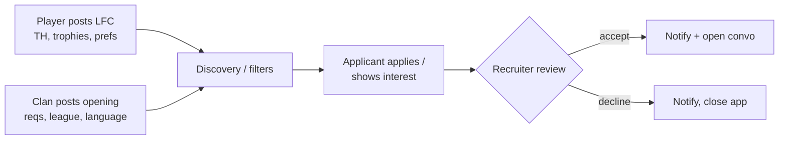

# 08 — Recruitment

## 16. Recruitment workflow

Two post types share one table (`type = lfc | clan`) and one application flow.

- **LFC profile:** TH, trophies, location, language, activity, war/CWL preference, competitive vs casual, preferred clan level/league.
- **Clan post:** clan info, required TH/trophies/activity, war frequency, CWL league, Clan Capital info, language, location, description, recruitment status (open/closed).
- **Apply:** one application per user per post (unique constraint); attach a verified CoC account so recruiters see real stats.
- **Recruiter side:** inbox of applications, accept/decline; accepted opens a scoped conversation (Messaging).
- **Anti-abuse:** rate-limit posting/applying, require a verified account to apply, report path on posts.
