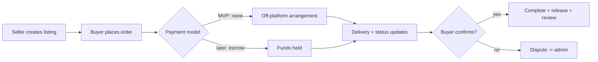

# 09 — Marketplace (post-MVP)

## 18. Marketplace workflow

**Permitted services only** — base design, base reviews, coaching, clan graphics, banners, video editing, tournament graphics. **Never** accounts, currency-for-cash, or anything against Supercell ToS.

**Risk posture — read before building payments:**
- **Money transmission:** holding/releasing funds (escrow) can classify you as a money transmitter/MSB, with licensing exposure. Do **not** custody funds directly.
- **Recommended:** if/when payments happen, use **Stripe Connect** (destination charges) so the provider moves money and handles KYC/payouts. Even then, escrow-style hold-and-release needs care.
- **Chargebacks & fraud:** digital services are high-dispute; require delivery proof, clear terms, dispute SLA.
- **Supercell ToS:** enforce a category allowlist; auto-reject account/currency listings; report path on every listing.
- **MVP decision:** ship marketplace as **listings + messaging + reviews only, no payments, no escrow**. Add Stripe Connect later, escrow last (or never).
