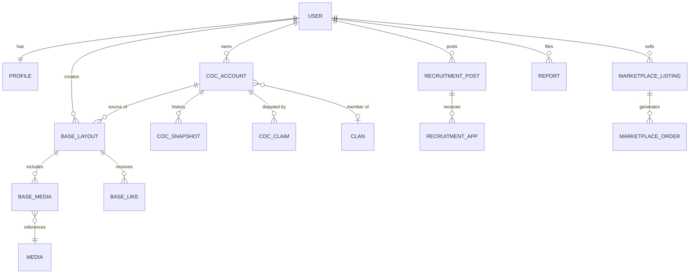
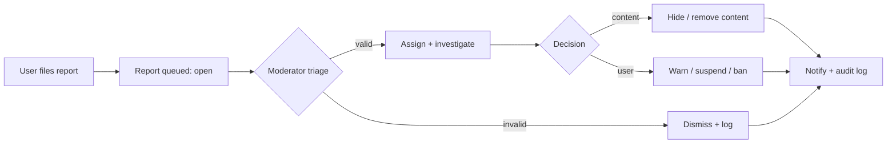
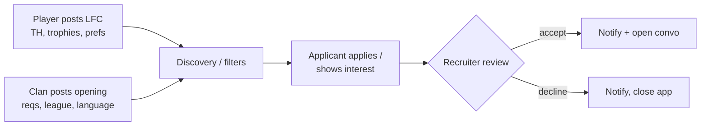
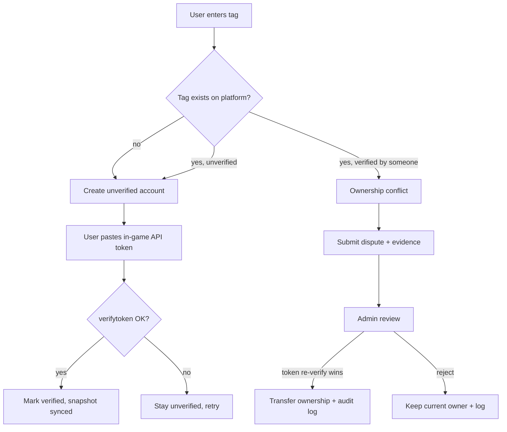
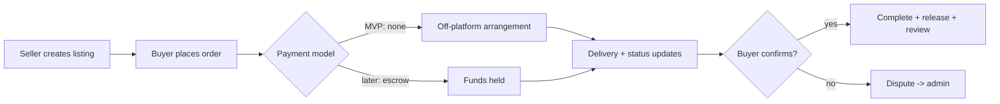

# CoC Community Platform — Technical Plan

_As of 2026-09-23_

A Laravel modular-monolith community platform for Clash of Clans players — account linking with tag verification, base sharing, recruitment, and a services marketplace — built to ship an MVP cheaply and scale by module. Stack uses Laravel's built-in (database/file) cache; no Redis.

> This is the consolidated plan. It is also split into loadable specs — see [README.md](README.md) for the per-file load order.

---

## 1. Product overview

A web platform where Clash of Clans players link multiple in-game accounts (verified by player tag), build public profiles, share base layouts with screenshots and replay links, recruit or find clans, and buy/sell permitted community services (graphics, coaching, base design). It is a trust-and-content platform, not a game utility: the hard problems are **verified account ownership** and **content moderation at scale**, not game mechanics.

- **Primary users:** individual players (link accounts, share bases, find clans) and clan leaders/recruiters (post openings, review applicants).
- **Secondary users:** service sellers (marketplace) and moderators/admins.
- **Value:** a single verified identity across a player's CoC accounts, plus discovery (bases, clans, players) the official app does not offer.
- **Non-goals (hard):** no buying/selling/transferring CoC *accounts*; no automation that violates Supercell's ToS; no storing media in the relational database.

## 2. MVP definition

The MVP proves the one thing nothing else can fake: **verified CoC account ownership**, then hangs base sharing off it. Ship this and nothing more:

1. Website auth (register, login, email verify, password reset, profile + avatar).
2. Link CoC accounts by tag, verified via the official **API token endpoint** (in-game token). Store a periodic snapshot of API data.
3. Public player profile showing verified accounts + their bases.
4. Base layouts: title, description, TH level, category, tags, base link, **images only (no video)**, likes + bookmarks + views.
5. Basic search/filter over bases and accounts (database-backed).
6. Reports + a minimal admin panel (users, accounts, bases, reports, suspensions, audit log).

**Explicitly deferred from MVP:** marketplace, payments/escrow, video upload, messaging, recruitment, following/social graph, achievements, dedicated search engine, email notifications (in-app only). See §26.

## 3. Functional requirements

| Domain | Must support |
| --- | --- |
| Accounts | Register, login/logout, email verify, password reset, edit profile, avatar upload, privacy settings, soft-delete account |
| CoC linking | Add account by tag, ownership verification via API token, snapshot sync, account states (unverified/verified/disputed/suspended), soft cap on linked accounts, per-account custom images |
| Profiles | Public profile: username, avatar, bio, verified accounts, featured account, bases, verified badge, stats |
| Bases | Create/edit/delete layout, images, category, tags, base link, likes, bookmarks, views, copy-clicks, reports, trending |
| Recruitment | Player "looking for clan" profiles; clan recruitment posts; apply / show interest |
| Marketplace | Seller profiles, listings, orders, order status, reviews, buyer/seller messaging, disputes (post-MVP) |
| Moderation | Report any entity, reason + evidence, moderator queue, decisions, suspensions/bans, audit trail |
| Notifications | In-app for verification, disputes, likes, comments, applications, orders, admin decisions; email optional |
| Search | Filter players, accounts, bases, clans, recruitment, listings; DB-backed first |
| Admin | Manage all entities, RBAC (User/Moderator/Admin/Super Admin), moderation + audit logs |

## 4. Non-functional requirements

- **Performance:** profile and base-list pages < 300 ms server time at MVP scale; heavy reads served from cache. CoC API never called synchronously in a user request path — always via queued jobs + cached snapshots.
- **Availability:** single-region, target 99.5% at MVP. The platform must degrade gracefully when the CoC API is down (serve stale snapshots, flag as stale).
- **Scalability:** stateless web tier so it scales horizontally; media offloaded to object storage + CDN; search designed to swap DB → dedicated engine without touching callers.
- **Cost:** minimal fixed infra — one app server, one managed Postgres, object storage (R2, zero egress), CDN. **No Redis**; cache and queue use the database driver initially.
- **Security & privacy:** first-class (§14); privacy settings honored on every public surface; audit log for every sensitive mutation.
- **Maintainability:** clear module boundaries (§21), policy-based authorization, no business logic in controllers.
- **Accessibility & UX:** responsive, mobile-first (most CoC players are on phones).

## 5. User roles and permissions

Four roles, RBAC via a policy layer. Guests read public content only.

| Capability | User | Moderator | Admin | Super Admin |
| --- | --- | --- | --- | --- |
| Manage own profile, accounts, bases | Yes | Yes | Yes | Yes |
| Report content | Yes | Yes | Yes | Yes |
| Review reports, hide content, warn | No | Yes | Yes | Yes |
| Resolve ownership disputes | No | Yes | Yes | Yes |
| Suspend / ban users | No | Limited (temp) | Yes | Yes |
| Manage marketplace listings/orders | No | Yes | Yes | Yes |
| Manage roles & permissions | No | No | Assign up to Moderator | Any |
| Manage system settings / feature flags | No | No | No | Yes |
| View audit logs | No | Own actions | Yes | Yes |

- **Scoping:** all user-owned mutations checked by policy (`can:update,base`), never by hidden route guards alone.
- **Super Admin** is a break-glass role; its actions are always audit-logged and it should be a tiny, fixed set of people.

## 6. Complete feature breakdown

- **Auth & account:** email/password, email verification, password reset, sessions, 2FA (post-MVP), privacy settings, avatar, soft delete + data export.
- **CoC accounts:** add by tag, token verification, snapshot sync (manual + scheduled), account states, featured account, per-account custom images (cap 5, 5 MB each), unlink.
- **Profiles:** public profile page, verified badge, stats rollup, followers/following (post-MVP), activity feed (post-MVP).
- **Bases:** CRUD, category (War, CWL, Farming, Trophy, Legend, Anti-3/2-Star, Hybrid, Progress, Troll), tags, base link, 2 images + 1 video (video post-MVP), likes, bookmarks, views, copy-clicks, trending, reports.
- **Recruitment:** LFC player profiles, clan recruitment posts, apply/interest, recruiter inbox.
- **Marketplace:** seller profiles, listings, orders, status flow, reviews, messaging, disputes, optional escrow (all post-MVP).
- **Messaging:** conversations + messages (recruitment/marketplace scoped first).
- **Notifications:** in-app center + read state; email opt-in.
- **Moderation & admin:** report intake, moderator queue, decisions, suspensions/bans, audit + moderation logs, RBAC panel.
- **Search & discovery:** filtered lists, trending, saved searches (post-MVP).

## 7. Recommended architecture

**Modular monolith.** One deployable Laravel app, internally split into bounded modules (§21) that talk through service classes and events, not by reaching into each other's models. This gives clean domain boundaries without the operational cost of microservices — correct for a solo/small team and a low infra budget.

- **Web tier:** stateless Laravel app, horizontally scalable behind a load balancer when needed.
- **Async tier:** queue workers (database driver initially) for CoC syncs, media processing, notifications.
- **Scheduler:** Laravel Scheduler (one cron entry) for periodic snapshot refresh, cleanup, trending recompute.
- **Data:** PostgreSQL (primary), object storage (Cloudflare R2) for media, CDN in front of media.
- **External:** official CoC API behind an anti-corruption service layer (§11).
- **Boundary rule:** cross-module communication via published domain events (e.g. `BaseLiked`, `AccountVerified`) and thin service interfaces; a module owns its tables and exposes read models, not raw Eloquent, to others.

## 8. Recommended Laravel & frontend stack

**Verdict: Laravel + Livewire + PostgreSQL, no Redis.** Fastest path to ship for a small team, one language, no separate API contract to maintain.

| Option | Fit for this project |
| --- | --- |
| **Laravel + Livewire (chosen)** | Server-rendered, reactive where needed, no API layer to build twice. Best velocity for a content/CRUD platform. |
| Laravel + Inertia + Vue/React | Only if a rich SPA or a public/mobile API is a near-term goal. Adds a JS build + client state overhead you don't need yet. |
| Separate API + SPA frontend | Overkill for MVP; defer until a mobile app is committed. |

**Stack:**
- **PostgreSQL** over MySQL — native JSONB for CoC snapshot blobs (heroes/troops/spells) and strong full-text search for the DB-first search phase.
- **Cache & queue: Laravel built-in drivers, no Redis.** Use the `database` driver for queues and either `database` or `file` cache to start. Postgres handles this comfortably at MVP scale; revisit Redis only when cache contention or queue throughput actually demands it.
- **Object storage:** Cloudflare R2 (S3-compatible, zero egress) + CDN.
- **Media processing:** queued workers (image resize/thumbnail via Intervention Image; video via a worker running ffmpeg, post-MVP).
- **Auth:** Laravel Fortify/Breeze foundation; Spatie laravel-permission for RBAC.
- **Trade-off of dropping Redis:** no sub-millisecond cache and DB-backed queues add write load. Acceptable at MVP; the cache/queue drivers are config-swappable, so adopting Redis later is a one-line change, not a rewrite.

## 9. Database schema

PostgreSQL. All tables carry `id` (bigint/uuid), `created_at`, `updated_at`; soft deletes where content is user-facing. Snapshot/JSON blobs use JSONB.

| Table | Purpose | Key columns | Relationships | Unique / indexes |
| --- | --- | --- | --- | --- |
| users | Website accounts | email, password_hash, email_verified_at, status | has profile, coc_accounts, roles | unique(email); index(status) |
| profiles | Public profile data | user_id, username, bio, avatar_path, featured_account_id, privacy JSONB | belongs to user | unique(user_id), unique(username) |
| roles / permissions / role_user | RBAC (Spatie) | name, guard | many-to-many users | unique(name) |
| coc_accounts | Linked in-game accounts | user_id, tag, ign, state, verified_at, last_synced_at | belongs to user, has snapshots | **unique(tag)**; index(user_id, state) |
| coc_account_claims | Ownership claims/disputes | coc_account_id, claimant_user_id, method, status, evidence JSONB, resolved_by | belongs to coc_account + users | index(coc_account_id, status) |
| coc_account_snapshots | Point-in-time API data | coc_account_id, th_level, trophies, war_stars, league, data JSONB, fetched_at | belongs to coc_account | index(coc_account_id, fetched_at desc) |
| clans | Known clans (from API) | tag, name, level, data JSONB, last_synced_at | has memberships | unique(tag) |
| clan_memberships | Account↔clan link | coc_account_id, clan_id, role, joined_at | belongs to both | index(clan_id); index(coc_account_id) |
| base_layouts | Shared bases | user_id, coc_account_id, title, th_level, category, base_link, visibility, like_count, view_count | belongs to user; has media, tags | index(th_level, category, visibility); index(user_id) |
| base_media | Images/video for a base | base_layout_id, media_id, kind, position | belongs to base + media | index(base_layout_id) |
| base_tags / tags | Tagging | base_layout_id, tag_id | many-to-many | unique(base_layout_id, tag_id) |
| base_comments | Comments | base_layout_id, user_id, body, parent_id, status | belongs to base + user | index(base_layout_id, status) |
| base_likes | Likes | base_layout_id, user_id | belongs to both | **unique(base_layout_id, user_id)** |
| base_bookmarks | Bookmarks | base_layout_id, user_id | belongs to both | unique(base_layout_id, user_id) |
| recruitment_posts | LFC + clan posts | type, user_id, clan_id, th_req, trophies_req, language, location, status, body | belongs to user/clan | index(type, status, language, location) |
| recruitment_applications | Applications/interest | recruitment_post_id, applicant_user_id, coc_account_id, status, message | belongs to post + user | unique(post_id, applicant_user_id) |
| marketplace_listings | Service listings | seller_id, category, title, price, status | belongs to seller (user) | index(category, status) |
| marketplace_orders | Orders | listing_id, buyer_id, seller_id, status, amount, escrow_state | belongs to listing + users | index(buyer_id); index(seller_id, status) |
| marketplace_reviews | Reviews | order_id, rater_id, rating, body | belongs to order + user | unique(order_id, rater_id) |
| conversations | Message threads | subject_type, subject_id (polymorphic) | has messages, participants | index(subject_type, subject_id) |
| messages | Messages | conversation_id, sender_id, body, read_at | belongs to conversation + user | index(conversation_id, created_at) |
| notifications | In-app notifications | user_id, type, data JSONB, read_at | belongs to user | index(user_id, read_at) |
| reports | Abuse reports | reporter_id, reportable_type, reportable_id, reason, evidence JSONB, status, assigned_to | polymorphic target | index(reportable_type, reportable_id); index(status) |
| moderation_actions | Mod decisions | moderator_id, target_type, target_id, action, reason | polymorphic target | index(target_type, target_id) |
| audit_logs | Sensitive-action trail | actor_id, action, subject_type, subject_id, before JSONB, after JSONB, ip | polymorphic subject | index(subject_type, subject_id); index(actor_id, created_at) |
| media | Object-storage file records | disk, path, mime, size, checksum, status, uploader_id | referenced by base_media, profiles, coc images | index(status); index(uploader_id) |

**Notes:** `coc_accounts.tag` unique enforces one platform-verified owner per tag (§17 handles conflicts). Denormalized counters (`like_count`, `view_count`) are maintained by events/jobs to avoid count(*) on hot paths. Avoid over-normalizing snapshot data — heroes/troops/spells live in one JSONB `data` column, not child tables.

## 10. Main entity relationships

One user owns many CoC accounts; each account carries a history of snapshots and produces bases. Reports, media, and audit logs attach polymorphically across the graph.



Reading it: `COC_ACCOUNT` is the hub — verification, snapshots, clan membership, and bases all hang off it, which is why `tag` uniqueness is the platform's integrity anchor.

## 11. CoC API integration architecture

Wrap the official API in an **anti-corruption service layer** so no controller or model ever calls it directly. The app depends on a `ClashClient` interface; a concrete adapter handles HTTP, auth, retries, and mapping to internal DTOs.

- **Credentials & IP:** Supercell API keys are IP-bound. Provision keys per outbound IP; store as encrypted secrets, never in code. On dynamic IPs use a fixed egress (proxy/NAT) so keys stay valid.
- **Verification:** ownership uses the `POST /players/{tag}/verifytoken` endpoint with the in-game API token the user pastes — the only reliable proof of ownership. This is the backbone of §17.
- **Rate limits & caching:** never call the API in a request path. All reads go through cached snapshots; refresh is queued. Cache API responses briefly to collapse duplicate lookups.
- **Background sync:** scheduled jobs refresh verified accounts (e.g. staggered every 6–12 h) and clan data; users get a throttled manual "refresh now" button.
- **Resilience:** retry with backoff on 5xx/429; circuit-breaker to stop hammering during outages; serve last snapshot and mark data **stale** with `last_synced_at`.
- **Failure handling:** persist failed sync attempts; alert on sustained failure; a tag that stops resolving flips the account to a `needs_reverify` flag rather than deleting data.
- **Decoupling:** the rest of the app reads only from `coc_accounts` + `coc_account_snapshots`, so the API can be swapped, mocked in tests, or rate-shaped without touching feature code.

## 12. Media & storage architecture

Media never touches the relational DB — only a `media` row (path, mime, size, checksum, status) points at an object in R2. CDN serves reads.

**Upload flow:** client requests a **signed, short-lived upload URL** → uploads directly to R2 → a queued job validates and finalizes → `media.status` goes `pending → ready` (or `rejected`).

- **Validation:** enforce size/count limits server-side; check MIME **and** file signature (magic bytes), not just extension; re-encode images to strip metadata/exploits; reject on mismatch.
- **Limits:** account images — max 5, 5 MB each. Base — max 2 images (5 MB each) + max 1 video (~30–60 s, ~50–100 MB, post-MVP).
- **Malware:** treat uploads as untrusted; scan (ClamAV worker or provider), serve from a cookieless CDN domain, never execute, force download-safe content types.
- **Access:** public content via CDN; private/pending media via signed, expiring URLs only.
- **Thumbnails:** generated in a worker on finalize; store derivatives as separate `media` rows linked to the original.
- **Video (post-MVP):** transcode + thumbnail via ffmpeg worker; enforce duration/size before publish; consider a managed provider if volume grows.
- **Cleanup:** orphaned-file reaper — scheduled job deletes R2 objects with no `media` row or `status=pending` past TTL; deleting a base/account enqueues media deletion; every delete is idempotent.

## 13. Authentication & authorization strategy

- **Authentication:** Laravel Fortify/Breeze — hashed passwords (bcrypt/argon2), email verification required before linking accounts, signed password-reset links, throttled login, optional 2FA (post-MVP).
- **Sessions:** server-side sessions, secure + http-only cookies, session fixation protection, regenerate on login, logout invalidates.
- **Authorization:** **policy-first**. Every model has a Policy; controllers/Livewire components call `authorize()` or `can`. No authorization logic scattered in views or route closures.
- **RBAC:** Spatie laravel-permission for roles (User/Moderator/Admin/Super Admin) and granular permissions; role checks layered on top of ownership policies.
- **Ownership vs role:** a User edits only their own resources (policy by `user_id`); Moderators/Admins get elevated policies via permissions — the two compose, IDOR is closed by always checking ownership.
- **Admin surface:** separate route group + middleware requiring an admin permission; Super Admin actions double-gated and audit-logged.
- **API tokens (future):** Sanctum when a mobile app or public API arrives.

## 14. Security requirements

| Threat | Control |
| --- | --- |
| SQL injection | Eloquent/query builder only, parameter binding; no raw string SQL |
| XSS | Blade auto-escaping; sanitize rich text; CSP header; escape user content in Livewire |
| CSRF | Laravel CSRF tokens on all state-changing requests |
| IDOR | Policy check on every resource by ownership; never trust IDs from the request |
| Broken authz | Policy-first, deny by default, tested with authorization tests |
| File upload attacks | Signature + MIME check, re-encode, size/count limits, malware scan, cookieless media domain |
| Mass assignment | Explicit `$fillable` / form-request validation; never `$request->all()` into models |
| API abuse / scraping | Rate limits per route + per user/IP, pagination caps, no bulk public export, bot detection on hot endpoints |
| Brute force | Login throttling, exponential backoff, captcha after N failures |
| Account enumeration | Uniform responses on login/reset/register (never reveal if email exists) |
| Session attacks | Secure/http-only cookies, regenerate on login, idle + absolute timeouts |
| Bot registration | Email verification, captcha, disposable-email block, rate limits |
| Privilege escalation | Role changes audit-logged, Super Admin gated, no client-controlled role fields |
| Improper admin access | Separate middleware + permission, IP allowlist optional, full audit trail |
| Marketplace scams | Verified sellers, reviews, dispute flow, no on-platform payments at MVP (§18) |

Cross-cutting: encrypt secrets and the stored CoC API token at rest, HTTPS everywhere, dependency scanning, audit log on every sensitive mutation, least-privilege DB user.

## 15. Moderation & reporting system

Any entity (profile, base, comment, recruitment post, listing, message, user) is reportable through one polymorphic pipeline.



- **Report:** reason (enum), free-text, evidence (links/screenshots), one target via `reportable_type/id`.
- **Queue:** status `open → assigned → resolved/dismissed`; assigned moderator; SLA visible.
- **Actions:** hide/remove content, warn, temp-suspend, ban — recorded in `moderation_actions`; user-facing outcome via notification.
- **Audit:** every decision writes `audit_logs` (actor, before/after, reason).
- **Abuse protections:** spam/bot controls, scam and fake-ownership handling (§17), malicious-upload scanning (§12), rate-limit abuse throttling, duplicate-content detection (image hashing on bases), mass-scraping defenses. Auto-flag heuristics (mass reports, new-account bursts) surface items to the queue but never auto-punish without review.

## 16. Recruitment workflow

Two post types share one table (`type = lfc | clan`) and one application flow.



- **LFC profile:** TH, trophies, location, language, activity, war/CWL preference, competitive vs casual, preferred clan level/league.
- **Clan post:** clan info, required TH/trophies/activity, war frequency, CWL league, Clan Capital info, language, location, description, recruitment status (open/closed).
- **Apply:** one application per user per post (unique constraint); attach a verified CoC account so recruiters see real stats, not claims.
- **Recruiter side:** inbox of applications, accept/decline, accepted opens a scoped conversation (§messaging).
- **Anti-abuse:** rate-limit posting/applying, require a verified account to apply, report path on posts.

## 17. CoC account claiming workflow

The integrity core of the platform. `coc_accounts.tag` is globally unique — exactly one **verified** owner per tag. Verification uses the in-game API token (`verifytoken`), the only real proof of ownership.



- **Happy path:** token verify flips state to `verified` and the account is exclusively the user's.
- **Conflict:** a second user cannot auto-attach a verified tag. They may (a) prove ownership by passing `verifytoken` themselves — which wins, since the token means current control — triggering an audited transfer, or (b) open a dispute for admin review where token proof isn't possible.
- **States:** `unverified`, `verified`, `disputed`, `suspended`.
- **Every transfer** writes `audit_logs` (old owner, new owner, method, admin). Losing owner is notified; their bases can be reassigned or hidden per policy.
- **Edge:** account changes hands in real life → new holder re-verifies with a fresh token and takes over; platform trusts current token control over historical claims.

## 18. Marketplace workflow

**Permitted services only** — base design, base reviews, coaching, clan graphics, banners, video editing, tournament graphics. **Never** accounts, gold-pass gifting for cash, or anything against Supercell ToS.



**Risk posture — read before building payments:**
- **Money transmission:** holding and releasing funds (escrow) can classify you as a money transmitter/MSB, with licensing exposure. Do **not** custody funds directly.
- **Recommended:** if/when payments happen, use **Stripe Connect** (marketplace/destination charges) so the provider is the money mover and handles KYC, payouts, and most compliance. Even then, escrow-style hold-and-release needs care.
- **Chargebacks & fraud:** digital services are high-dispute; require delivery proof, clear terms, and a dispute SLA.
- **Supercell ToS:** enforce a category allowlist; auto-reject account/currency-related listings; report path on every listing.
- **MVP decision:** ship marketplace as **listings + messaging + reviews only, no payments, no escrow**. Add Stripe Connect later, escrow last (or never). This keeps the platform out of regulated-payments scope while proving demand.

## 19. Major edge cases

- **Tag ownership churn:** account sold/traded in real life → re-verification transfers ownership; old bases must be reassigned, hidden, or kept per policy.
- **Tag becomes invalid:** player deletes account or Supercell purges tag → flag `needs_reverify`, keep data, stop syncing.
- **API outage / rate limit:** serve stale snapshots flagged as such; queue backs up gracefully; manual refresh throttled.
- **Duplicate bases:** same layout reposted → perceptual image hashing flags near-duplicates for moderation.
- **Deleted user with content:** soft-delete cascades — decide whether bases survive anonymized or are removed; orphaned media reaped.
- **Concurrent verification:** two users submit tokens for one tag near-simultaneously → last valid token wins under a DB lock; both actions audited.
- **Media finalize failure:** upload succeeds to R2 but finalize job fails → `pending` media reaped by TTL; user sees retry.
- **Privacy vs discovery:** a private profile must be excluded from search, trending, and recruiter views everywhere — enforced centrally, not per-page.
- **Report brigading:** mass reports on one target → rate-limit + de-duplicate, surface once to moderators, never auto-action.
- **Marketplace non-delivery / scam:** dispute path, seller reputation, and (with payments) provider-side chargeback handling.
- **Snapshot staleness on profiles:** always show `last_synced_at` so users understand data isn't live.

## 20. Development phases

Reordered slightly from the brief: comments/notifications/reports move earlier because bases need moderation and feedback the moment they exist.

| Phase | Scope | Exit criteria |
| --- | --- | --- |
| **0. Foundation** | Project skeleton, modules, CI, auth (Fortify/Breeze), RBAC, policies, media pipeline stub | A user can register, verify email, log in; roles enforced |
| **1. CoC integration** | `ClashClient` adapter, token verification, snapshots, scheduled sync | User links + verifies a real account; snapshot shows |
| **2. Player accounts & profiles** | Multiple accounts, states, featured account, public profile, account images | Verified accounts render on a public profile |
| **3. Bases (images)** | Base CRUD, categories, tags, images, likes, bookmarks, views, trending | Users publish and discover bases |
| **4. Community & safety** | Comments, in-app notifications, reports, moderation queue, admin panel | Content can be reported and moderated end-to-end |
| **5. Recruitment** | LFC + clan posts, applications, recruiter inbox | Player applies; recruiter accepts |
| **6. Messaging** | Scoped conversations for recruitment/marketplace | Two users message within a scope |
| **7. Marketplace (no payments)** | Seller profiles, listings, orders, reviews | Listings live with reviews, no funds moved |
| **8. Advanced** | Video upload, search-engine migration, following, achievements, analytics, email notifications, Stripe Connect | Feature-flagged rollouts |

Phases 0–4 constitute the MVP. Each phase is independently shippable behind feature flags.

## 21. Laravel module & folder structure

Modules under `app/Modules/<Domain>`, each self-contained (models, services, policies, Livewire components, events, jobs). Cross-module calls go through service interfaces + events only.

```
app/
  Modules/
    Auth/
    Users/            # profiles, privacy, avatars
    CocIntegration/   # ClashClient, adapters, DTOs, sync jobs
    PlayerAccounts/   # coc_accounts, claims, snapshots, verification
    Clans/            # clans, memberships
    Bases/            # layouts, tags, likes, bookmarks, trending
    Recruitment/      # posts, applications
    Marketplace/      # listings, orders, reviews, disputes
    Messaging/        # conversations, messages
    Media/            # upload URLs, validation, thumbnails, cleanup
    Notifications/     # in-app center, channels
    Moderation/       # reports, actions, queues
    Admin/            # RBAC panel, dashboards
  Support/            # shared value objects, base classes
Each module:
    Models/  Services/  Policies/  Http/ (Livewire+Controllers)
    Jobs/  Events/  Listeners/  Actions/  routes.php  migrations/
```

- **Boundaries:** a module owns its tables and migrations; others read via its Service/read-model, never its Eloquent models directly.
- **Events over calls:** `AccountVerified`, `BaseLiked`, `ReportFiled` decouple side effects (notifications, counters, audit).
- **Enforcement:** an architecture test (deptrac/pest) fails the build on illegal cross-module references.

## 22. Background jobs & scheduled tasks

Queue driver: **database** (no Redis). Workers run via `queue:work`; Scheduler runs one system cron.

**Queued jobs (event-driven):**
- `VerifyCocToken`, `SyncCocAccount`, `SyncClan` — API calls off the request path.
- `ProcessUploadedMedia` (validate, scan, thumbnail), `TranscodeVideo` (post-MVP).
- `SendNotification` (in-app fan-out; email later), `RecomputeBaseCounters`.
- `DetectDuplicateBase` (image hashing) on publish.

**Scheduled tasks (Scheduler):**

| Task | Cadence | Purpose |
| --- | --- | --- |
| Refresh verified accounts | every 6–12 h, staggered | keep snapshots current within API limits |
| Refresh clan data | daily | clan levels, membership |
| Recompute trending | hourly | trending bases ranking |
| Reap orphaned media | hourly | delete pending/unreferenced R2 objects |
| Prune stale sessions/tokens | daily | hygiene |
| Retry failed syncs | every 30 min | drain failed-job backlog |

- **Queue health:** monitor `failed_jobs`; alert on depth/age. Because queues sit in Postgres, watch table bloat and vacuum.
- **Backoff:** external-API jobs use exponential backoff + max attempts, then dead-letter for manual review.

## 23. Caching strategy (Laravel built-in, no Redis)

Use Laravel's cache abstraction with the **database** (or **file**) driver. Because it's the same `Cache` API Redis uses, swapping to Redis later is a config change, not a code change.

- **What to cache:**
  - CoC snapshot reads — already persisted in `coc_account_snapshots`; cache the assembled profile view.
  - Trending/popular base lists — recomputed by a job, cached for the hour.
  - Expensive aggregates (profile stats, counts) — cache with short TTL, invalidate on write via events.
  - Config/reference data (categories, tags) — long TTL.
  - CoC API responses — brief TTL to collapse duplicate lookups within the rate window.
- **Invalidation:** event-driven (`BaseLiked` → bust that base's cache); tag-able caches per entity where the driver supports it; otherwise versioned cache keys.
- **Counters:** maintain `like_count`/`view_count` columns updated by jobs rather than caching `count(*)`; views can be buffered and flushed periodically to avoid write storms.
- **Rate limiting:** Laravel's rate limiter on the database/cache store — sufficient at MVP.
- **Limits to accept:** database cache adds read/write load to Postgres and lacks Redis's atomic primitives (locks, sorted sets). Fine at MVP scale; the trigger to adopt Redis is measured cache-table contention or lock needs, not a guess.

## 24. Scaling considerations

- **Web tier:** stateless → add app instances behind a load balancer; sessions in DB/cookie so any instance serves any request.
- **Database first bottleneck:** it's also the cache + queue store here. Scale by: read replicas for heavy read pages, connection pooling (PgBouncer), indexing discipline, then move cache/queue to Redis when Postgres write load from those specifically becomes the constraint.
- **Queues:** scale workers horizontally; partition by queue (sync vs media vs notifications) so slow media jobs don't starve verification.
- **Media:** already offloaded to R2 + CDN — scales independently of the app.
- **Search:** DB full-text → dedicated engine (Meilisearch/Typesense/Elastic) behind the same search interface when result quality or query load demands it.
- **CoC API:** the true hard ceiling — respect rate limits with staggered syncs, longer snapshot TTLs, and prioritizing active users; more keys/IPs only within Supercell's terms.
- **Sequence of scaling moves:** indexes + caching → read replica → Redis for cache/queue → dedicated search → extract a hot module to its own service only if a single domain clearly outgrows the monolith.

## 25. Risks & assumptions

**Assumptions:**
- Supercell's public API remains available and its `verifytoken` endpoint stays the ownership-proof mechanism.
- Outbound traffic can use a fixed IP (or proxy) so IP-bound API keys work.
- Base sharing means storing metadata + screenshots + the in-game share link — the platform does not reconstruct or host playable layouts.
- Team is small; velocity and low ops overhead matter more than premature scale.

**Risks:**

| Risk | Impact | Mitigation |
| --- | --- | --- |
| API terms/rate changes | Core features break | Adapter layer isolates it; cache-first; degrade to stale |
| Ownership disputes are gameable | Trust erosion | Token-control-wins rule + audited transfers + admin review |
| Marketplace payments = regulatory exposure | Legal/financial | No custody; Stripe Connect only; escrow last or never |
| Postgres as cache+queue+DB | Perf ceiling | Config-swappable to Redis; monitor early |
| Malicious uploads | Security incident | Signature check, re-encode, scan, cookieless CDN |
| Moderation load grows faster than team | Abuse/spam | Auto-flag heuristics, rate limits, dedupe, report triage |
| Scraping of player/base data | IP/abuse | Rate limits, pagination caps, bot detection |
| Legal: hosting user media | Takedown/DMCA | Clear ToS, report + takedown flow, audit logs |

## 26. Features that should NOT be in the MVP

Cut these from v1 — they add cost, risk, or complexity before demand is proven:

- **Marketplace payments & escrow** — regulatory exposure; even listings/messaging is post-MVP. Defer escrow indefinitely.
- **Video upload & transcoding** — start images-only; video is a heavy pipeline (ffmpeg, storage, moderation cost).
- **Messaging/DMs** — defer until recruitment/marketplace need it; abuse surface.
- **Following / social graph / activity feed** — nice-to-have, not core to the trust proposition.
- **Achievements & badges** (beyond a verified badge) — gamification later.
- **Dedicated search engine** — DB full-text is enough at launch.
- **Email notifications** — in-app only first; email is opt-in later.
- **2FA, public API, mobile app, Sanctum tokens** — after product-market fit.
- **Real-time (websockets/broadcasting)** — polling/refresh is fine at MVP.
- **Recommendations & analytics dashboards** — Phase 8.

**True MVP = verified accounts + public profiles + base sharing (images) + reports/moderation.** Everything above is deliberately deferred.

---

_This plan is structured so each phase (§20) can be expanded into specs and development tasks for an agentic coding workflow._
